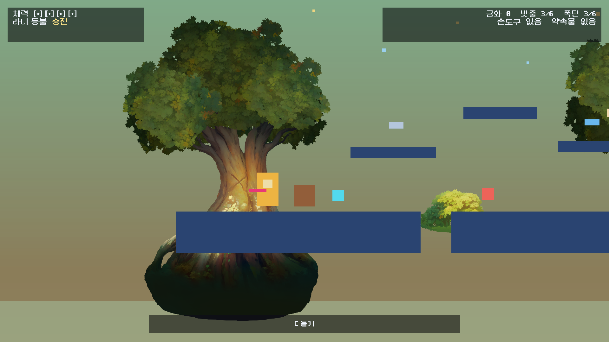

# 별을 물어오는 밤 — RW1 플레이어와 경량 인벤토리

- 기준 기획: `별을_물어오는_밤_게임시스템_전면리뉴얼_하네스_v1.0.md`
- 브랜치: `rewrite/system-v1`
- Unity: `6000.3.8f1`
- 대상 씬: `Assets/Scenes/StarNightRewrite/RW_CH1_Bootstrap.unity`
- 상태: RW1 구현 및 자동 검증 완료

## 1. 이번 단계의 플레이 목표

RW1은 전면 리뉴얼의 첫 조작 가능한 기반이다. 플레이어가 화면을 보며 바로 이동하고, 뛰고, 떨어졌다가 복귀하고, 소모품과 한 손 도구의 현재 상태를 판단할 수 있게 만드는 데 범위를 제한했다.

완료 기준은 다음과 같다.

- 이동, 점프, 낙하 속도 제한과 낙하 복구가 안정적으로 동작한다.
- 밧줄과 폭탄을 소지하고 사용 요청을 보낼 수 있다.
- 한 손 도구는 한 종류만 장착되며 새 도구를 주우면 교체된다.
- 체력, 금화, 밧줄, 폭탄, 도구, 약속 물건, 라니 등불 상태가 별도 인벤토리 화면 없이 HUD에 보인다.
- 라니 등불은 챕터당 한 번 체력 고갈을 구조한다.

## 2. 조작과 수치

| 기능 | 키보드 | 게임패드 |
|---|---|---|
| 이동 | A/D, 방향키 | 왼쪽 스틱, D-pad |
| 점프 | Space | South 버튼 |
| 상호작용 | E | West 버튼 |
| 한 손 도구 | J | North 버튼 |
| 밧줄 | Q | LB |
| 폭탄 | R | RB |
| 일시정지 요청 | Esc | Start |

주요 이동 수치는 최고 속도 5.5, 지상 가속 35, 지상 감속 45, 공중 제어 75%, 점프 높이 2.8, 점프 버퍼 0.12초, 코요테 타임 0.12초, 최대 낙하 속도 12다. 점프는 버튼을 일찍 놓으면 상승 속도를 줄이는 가변 높이 방식이다.

체력은 4칸이며 피격 후 1.3초 동안 무적이다. 낙하 한계선 아래로 떨어지면 최근 안전 앵커로 돌아오고 체력 1칸을 잃는다. 낙하 판정은 보간된 화면 좌표가 아니라 Rigidbody2D의 실제 위치를 사용한다.

라니 등불은 챕터당 한 번만 발동한다. 체력이 0이 되는 순간 안전 앵커로 복귀하고 체력 2칸과 1.5초의 안전 시간을 얻으며, 보유한 물건은 유지한다.

## 3. 경량 인벤토리 규칙

시작 상태는 체력 4, 밧줄 3, 폭탄 3, 금화 0, 한 손 도구 없음, 약속 물건 없음이다.

- 밧줄과 폭탄의 최대 보유량은 각각 6이다.
- 한 손 도구 슬롯은 하나뿐이다.
- 약속 물건 슬롯도 하나뿐이다.
- 금화는 정수 상태로 누적하고 지불한다.
- 전체 화면 인벤토리는 만들지 않았다.
- HUD가 현재 상태와 가까운 상호작용 대상을 항상 보여준다.

`RunContext`가 런 단위 `RunLoadout`을 소유하며, 플레이어 쪽 `ConsumableInventory`와 `PlayerToolController`가 입력 및 HUD에 연결된다.

## 4. 샌드박스 구성

`RW1 Sandbox` 루트 아래에 다음 검증 구간을 구성했다.

- 이동과 점프용 지형 및 발판
- 안전 앵커와 낙하 복구 구간
- 밧줄·폭탄 보급품
- 곡괭이·우산 교체 픽업
- 들고 던질 수 있는 상자
- 피해 가시와 회복 픽업
- 2D Fantasy Sprite Bundle의 숲, 산, 나무, 덤불, 반딧불 배경
- 플레이어 추적용 횡스크롤 카메라
- 인벤토리 화면 없이 상태를 보여주는 런타임 HUD

재구성은 Unity 메뉴 `Star Night Rewrite/RW1/Rebuild Movement Sandbox`로 반복 실행할 수 있으며, 이름이 같은 `RW1 Sandbox`만 교체한다.

## 5. 검증 결과

| 검증 | 결과 |
|---|---:|
| EditMode | 13/13 통과 |
| PlayMode | 4/4 통과 |
| 씬 누락 스크립트 | 0 |
| 씬 깨진 프리팹 | 0 |
| 최종 Console 경고/오류 | 0 |
| 리라이트 영역의 금지 레거시 참조 | 0 |

EditMode에서는 RW0 격리 규칙과 적재량, 소모품 상한, 도구 교체, 약속 물건, 금화, 체력, 무적, 회복, 점프 보조, 라니 등불 상태를 검증했다.

PlayMode에서는 실제 키보드 이동·점프, 낙하 복구와 체력 차감, 라니 등불의 첫 고갈 구조 및 두 번째 고갈 패배, 운반물 줍기와 던지기를 검증했다.

## 6. RW2로 미룬 범위

RW1의 Q/R/J 입력은 사용할 의도를 발생시키지만, 월드 규칙이 성공했을 때만 수량을 차감하도록 분리했다. 다음 단계에서 아래 기능을 붙인다.

- 밧줄의 실제 설치, 연결점, 등반 및 회수
- 폭탄의 배치, 점화, 폭발, 지형·오브젝트 반응
- 곡괭이와 우산 등 한 손 도구의 실제 월드 효과
- 성공한 사용에 대한 소모품 커밋과 실패 피드백
- 도구와 약속 물건을 활용하는 첫 방 단위 퍼즐

즉 RW1은 플레이어의 몸, 생존, 소지 상태, HUD 계약을 고정한 단계이며, 도구로 길을 만드는 핵심 플레이 문법은 RW2에서 구현한다.

